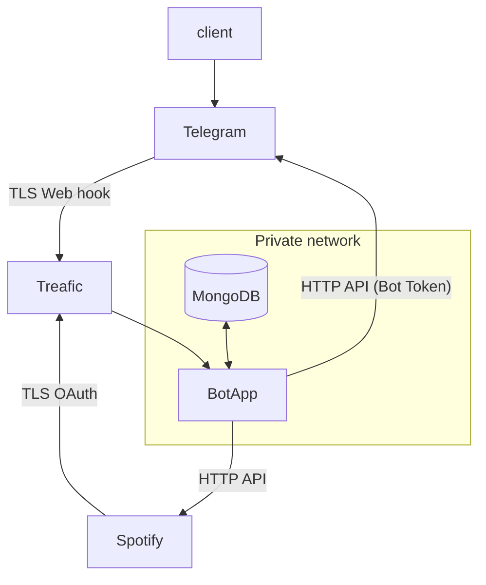
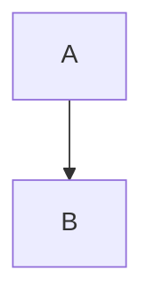

# Spotify share 
Telegram bot in share link play in you spotify

## Spotify link

- User apps: https://www.spotify.com/account/apps/
- App dashboard: https://developer.spotify.com/dashboard/applications/
- OAuth: https://developer.spotify.com/documentation/general/guides/authorization-guide/
- Get the User's Currently Playing Track: https://developer.spotify.com/documentation/web-api/reference/player/get-the-users-currently-playing-track/

## Schema architecture app 

<!-- generated by mermaid compile action - START -->

  
Mermaid markup

<!-- generated by mermaid compile action - END -->

<!-- generated by mermaid compile action - START -->

  
Mermaid markup

<!-- generated by mermaid compile action - END -->
